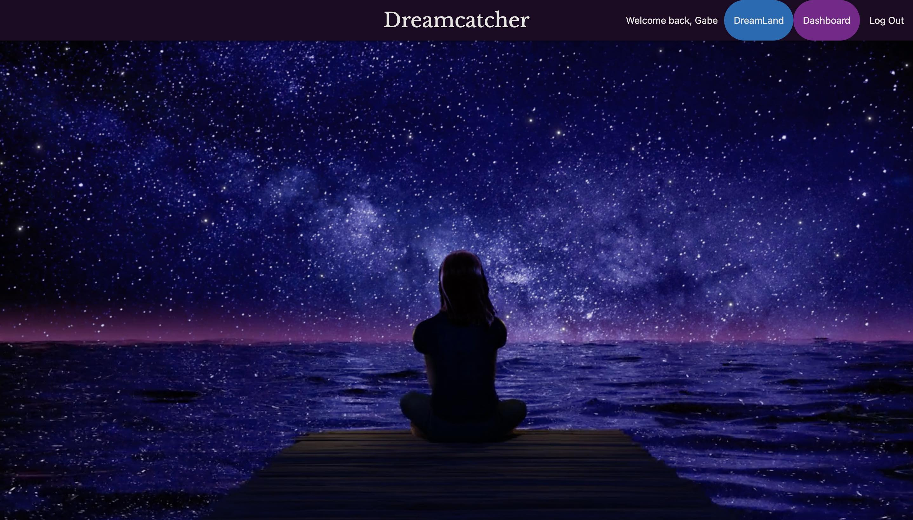

# DreamCatcher
How did you sleep last night? Did you have any interesting dreams? Dreamcatcher allows you to quickly capture your dream as you wake up. Then easily access, update and delete dream entries. Dive deeper into the stories that go on in your mind at night.

**Link to project:** https://dreamcatcher-production.up.railway.app/

## How It's Made:

**Tech used:** HTML, CSS, JavaScript, Node, Express

For the front end I used HTML, CSS, and javascript/ EJS. This was my first attempt at using Materialize for CSS, and I kinda liked it but would probably go with a different framwork next time.  For the backend I used Node.js/ Express.js and mongoDb. Writing backend code with this stack is pretty cool and look forward to expanding my knowledge with that. Most of the issues I encountered had been answered already.  

## Optimizations
I continue to look into ways of improving the efficiency of my codebase as well as developing helpful features.  One such feature was the addition of a voice to text option for dictating the content of your dream. (no one wants to type out their dream right after waking up. Aint no one got time for that!)

## Lessons Learned:

This project revealed to me the importance of designing with user experience in mind.  My initial design did not feel intuitive to some of the early test users.  Through ongoing feedback, I continue to incorporate the user's experience of the app into development.  

## Examples:
Take a look at these couple examples that I have in my portfolio:

**Palettable:** https://github.com/gabrielarce/peanut-gallery

